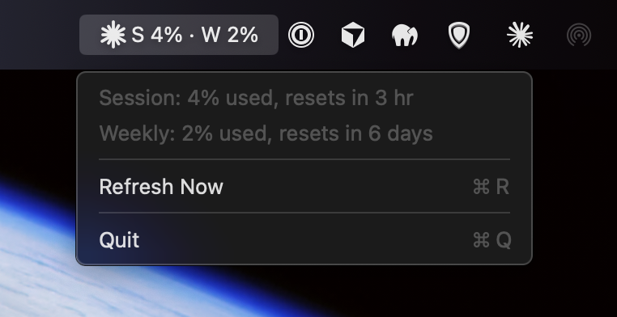

# ClaudeUsageBar

A tiny macOS menu bar app that shows how much of your Claude plan's session
and weekly limits you've used, without opening claude.ai or running `/usage`
in Claude Code.



The menu bar item shows a starburst, then the session (5-hour window) and
weekly percentages. Click it for the reset countdowns, a manual refresh, a
Launch at Login toggle, and Quit. If the item is greyed out, the last poll
failed and the menu says why.

## Install

**Requirements**

- macOS 13 or later, Apple Silicon or Intel.
- [Claude Code](https://claude.com/claude-code) installed and signed in at
  least once with a Pro, Max or Team account. The app reuses that sign-in.
  You don't need to keep using Claude Code afterwards.

**Steps**

1. Download `ClaudeUsageBar-x.y.z.zip` from the
   [latest release](../../releases/latest).
2. Unzip it and drag `ClaudeUsageBar.app` into your Applications folder.
3. Open it. macOS will refuse the first time; see the next section.
4. Open System Settings → Privacy & Security, scroll down to the message
   saying ClaudeUsageBar was blocked, click **Open Anyway**, and confirm.
5. Optionally tick **Launch at Login** in the app's menu.

### Why macOS blocks it the first time

Apps downloaded from the internet must be signed with an Apple Developer ID
and notarized by Apple, or Gatekeeper refuses to open them. That requires a
paid Apple Developer Program membership, which this free project doesn't
have. The release build is instead "ad-hoc" signed, which is enough to run
but not enough to satisfy Gatekeeper on a downloaded copy.

The **Open Anyway** step above is the supported way through. It's needed
once per download. On macOS 14 and earlier you can also Control-click the
app and choose Open. If you prefer the terminal:

```bash
xattr -d com.apple.quarantine /Applications/ClaudeUsageBar.app
```

Two other routes avoid the prompt entirely: build it yourself (locally built
apps aren't quarantined), or sign it with your own Developer ID as described
under [Signing with your own Developer ID](#signing-with-your-own-developer-id).

## How it works, and what it doesn't do

- It reads the OAuth token that Claude Code stores in your login Keychain,
  in the item named `Claude Code-credentials`, using the system `security`
  tool. Nothing is written to the Keychain.
- Every 5 minutes, and when you open the menu (at most once a minute), it
  calls `https://api.anthropic.com/api/oauth/usage` with that token. That is
  the same endpoint behind claude.ai's Usage page and Claude Code's `/usage`.
- Nothing is sent anywhere else. Reading usage doesn't consume usage.
- It never refreshes the token. If the sign-in expires, the menu asks you to
  open Claude Code once, which refreshes it.
- **This is not a published Anthropic API.** The endpoint, its fields, and
  the auth scheme can change or disappear without notice. If that happens
  the app will show an error until it's updated.
- Pro and Max plans share one usage pool across claude.ai, the desktop and
  mobile apps, and Claude Code, so the numbers are for your whole account.
  Team and Enterprise seats may report differently.

## Troubleshooting

| Symptom | Meaning |
| --- | --- |
| Greyed out or ⚠️ | The last poll failed. Open the menu for the reason. |
| "No Claude Code sign-in found" | Run `claude` in a terminal and sign in with your subscription. |
| "Sign-in expired" | Open Claude Code once so it refreshes the token. |
| "Rate limited by Anthropic" | The endpoint allows only a few requests a minute per account and is shared with tools like ccusage. It recovers on its own. |
| The item vanishes from the menu bar | On Macs with a notch, macOS silently hides status items that don't fit, and which ones fit depends on the frontmost app's menus. The app is still running. Switch to an app with fewer menus, remove some other menu bar items, or use a menu bar manager such as Ice or Bartender. |

## Building from source

You need the Xcode Command Line Tools (`xcode-select --install`). Full
Xcode is not required.

```bash
swift run                # build and run in place, handy for development
scripts/make-app.sh      # universal .app and zip in dist/
```

The script builds arm64 and Intel binaries, combines them, wraps them in
`ClaudeUsageBar.app` with an icon, ad-hoc signs the bundle, and zips it. The
version comes from the current git tag, or pass one: `scripts/make-app.sh 1.2.0`.

## Signing with your own Developer ID

If you're a member of the Apple Developer Program, the same script can
produce a notarized build that opens on any Mac with no Gatekeeper step.

1. Install a **Developer ID Application** certificate in your login Keychain
   (create it at developer.apple.com under Certificates, or via Xcode →
   Settings → Accounts → Manage Certificates). Confirm it's visible:

   ```bash
   security find-identity -v -p codesigning
   ```

2. Store notarization credentials once, using an app-specific password from
   appleid.apple.com and your team ID:

   ```bash
   xcrun notarytool store-credentials ClaudeUsageBar \
     --apple-id you@example.com --team-id TEAMID --password app-specific-password
   ```

3. Build with both variables set:

   ```bash
   CODESIGN_IDENTITY="Developer ID Application: Your Name (TEAMID)" \
   NOTARY_PROFILE=ClaudeUsageBar scripts/make-app.sh 1.0.0
   ```

The script signs with the hardened runtime, submits the zip to Apple, waits
for the verdict, staples the ticket to the app, and re-zips it. Set only
`CODESIGN_IDENTITY` to sign without notarizing. The bundle identifier is
`com.ClaudeUsageBar`, set near the top of `scripts/make-app.sh`.

## Development notes

- `CLAUDE_USAGE_DEBUG=1 swift run` prints the raw usage JSON on every poll.
  The shape the app relies on is documented in `Sources/ClaudeUsageBar/UsageModels.swift`.
- Poll cadence: `pollInterval` in `StatusBarController.swift` (timer) and
  `minimumPollInterval` in `UsageAPI.swift` (floor for manual refreshes and
  menu opens).
- The menu bar glyph is drawn in code in `StatusBarController.swift`. The
  app icon is rendered by `swift scripts/make-icon.swift` into
  `Resources/AppIcon.png`.
- The whole target builds cleanly with `-swift-version 6` strict
  concurrency checking, and the CI workflow checks that on every push and
  pull request.
- Releasing: tag a commit `vX.Y.Z` and push the tag. The Release workflow
  runs `scripts/make-app.sh` on a macOS runner and attaches the zip to a
  GitHub release with generated notes. That build is ad-hoc signed; for a
  notarized release, run the script locally with the variables above and
  upload the result with `gh release upload vX.Y.Z dist/ClaudeUsageBar-X.Y.Z.zip --clobber`.

## License

MIT. See [LICENSE](LICENSE).
